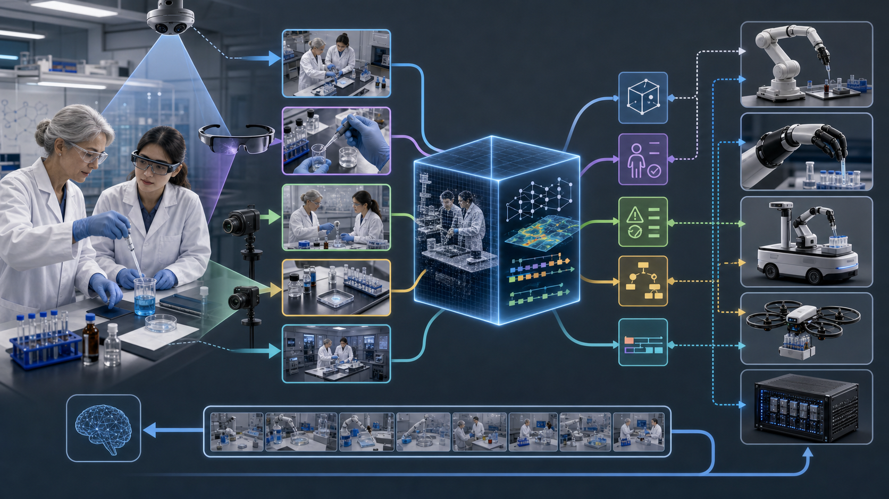

# Human-Centered Laboratory Autonomy

Author: Lachlan Chen, AgInTiFlow
Affiliation: AgInTi Lab, LazyingArt LLC

## Thesis

The strongest path to useful laboratory robotics is not to start by copying the full human body. A complete bionic laboratory worker would need hands, arms, eyes, navigation, safety behavior, tool use, chemical compatibility, cleaning, calibration, protocol reasoning, exception handling, and accountability. That is too broad for a first product.

The better strategy is human-centered and scene-centered:

1. Treat the human laboratory worker as the current best general-purpose embodiment.
2. Use AR glasses to reduce cognitive load and guide protocol execution.
3. Use fixed cameras, egocentric video, and instrument logs to convert the lab into an observable scene.
4. Build a protocol-state and scene-graph layer that understands objects, steps, evidence, risks, and exceptions.
5. Add robot assistance only for constrained, verified, high-value actions.
6. Use scene-video demonstrations to train models, rather than training only on hands, grippers, or joint trajectories.
7. Connect humans, robot hands, robot arms, mobile bodies, drones, instruments, and AI reasoning through capability contracts.

The product thesis is simple:

> Do not replace the scientist first. Instrument the scientist, the protocol, and the scene first. Then let robots take over only the bounded actions that the scene model can verify.

## Publication Pack

<table>
  <thead>
    <tr>
      <th align="left">Artifact</th>
      <th align="left">Role</th>
      <th align="left">Link</th>
    </tr>
  </thead>
  <tbody>
    <tr>
      <td>Human-Centered Laboratory Autonomy</td>
      <td>Canonical English roadmap and product thesis.</td>
      <td><a href="../publications/human-centered-laboratory-autonomy/human-centered-laboratory-autonomy.pdf">PDF</a> · <a href="../publications/human-centered-laboratory-autonomy/human-centered-laboratory-autonomy.tex">TeX</a></td>
    </tr>
    <tr>
      <td>以人为中心的实验室自主化</td>
      <td>Chinese companion publication.</td>
      <td><a href="../publications/human-centered-laboratory-autonomy-zh/human-centered-laboratory-autonomy-zh.pdf">PDF</a> · <a href="../publications/human-centered-laboratory-autonomy-zh/human-centered-laboratory-autonomy-zh.tex">TeX</a></td>
    </tr>
    <tr>
      <td>Robotic Laboratory Automation Feasibility Roadmap</td>
      <td>Archived predecessor: experiment-centered robotic workcell strategy.</td>
      <td><a href="../publications/human-centered-laboratory-autonomy/reference-pack/robotic-lab-automation-feasibility-roadmap.pdf">PDF</a> · <a href="../publications/human-centered-laboratory-autonomy/reference-pack/robotic-lab-automation-feasibility-roadmap.tex">TeX</a></td>
    </tr>
    <tr>
      <td>Robotic Laboratory Automation Market Research Roadmap</td>
      <td>Archived predecessor: market sizing, customers, competitors, economics, and safety.</td>
      <td><a href="../publications/human-centered-laboratory-autonomy/reference-pack/robotic-lab-automation-market-research-roadmap.pdf">PDF</a> · <a href="../publications/human-centered-laboratory-autonomy/reference-pack/robotic-lab-automation-market-research-roadmap.tex">TeX</a></td>
    </tr>
    <tr>
      <td>机器人实验室自动化市场研究路线图</td>
      <td>Chinese archived market research companion.</td>
      <td><a href="../publications/human-centered-laboratory-autonomy/reference-pack/robotic-lab-automation-market-research-roadmap-cn.pdf">PDF</a> · <a href="../publications/human-centered-laboratory-autonomy/reference-pack/robotic-lab-automation-market-research-roadmap-cn.tex">TeX</a></td>
    </tr>
    <tr>
      <td>Research source register</td>
      <td>Supporting references for self-driving labs, AR, camera monitoring, and VLA robotics.</td>
      <td><a href="../publications/human-centered-laboratory-autonomy/reference-pack/research-sources.md">Markdown</a></td>
    </tr>
  </tbody>
</table>

## Why This Matters

Most robotics demos show impressive isolated manipulation. Real laboratories require complete, repeated protocol execution with traceability, safety, contamination control, calibration, exception recovery, operator trust, and economics. The hard part is not only a better robot hand. The hard part is knowing:

- what the current protocol step is;
- what object matters now;
- what failure looks like;
- what evidence proves completion;
- what safety constraint is active;
- when human approval is required.

This idea closes the gap between robot demos and real deployment by making the laboratory itself a learning and execution environment.

The differentiated position is:

- **Human-first:** use people where general dexterity and judgement still dominate.
- **Camera-first:** turn implicit visual checks into structured data.
- **AR-first:** make protocols playable, visible, and hard to skip.
- **Robot-later:** automate only bounded actions after evidence exists.
- **Scene-video-first:** train models on complete situated demonstrations, not only robot trajectories.
- **Multi-embodiment:** treat human, robot arm, robot hand, drone, mobile base, and instrument as executors of the same protocol-scene graph.

## Merged Direction

The archived robotic-lab reports and the newer human-centered report should be treated as one product arc, not separate ideas.

### Archived Direction: Experiment-Centered Robot Workcell

The archived reports argue that the first business should not be a generic humanoid or bare robot arm. The better first product is a workflow-specific robotic laboratory workcell with strong data capture and auditability.

Key points to preserve:

- Laboratory automation and laboratory robotics are real markets, but they are crowded and integration-heavy.
- The first product should focus on a high-value protocol family, not general lab chores.
- The workcell should combine physical execution, protocol state, QC evidence, provenance, and learning feedback.
- Early customers are likely research labs, core facilities, CROs, process-development teams, and teaching labs.
- Strong wedge workflows include sample preparation, plate handling, imaging preparation, assay setup, and repetitive instrument loading.
- Robot value is highest when the work is repetitive, hazardous, traceable, high-frequency, or physically constrained.

### Current Direction: Human-Centered Laboratory Autonomy

The newer report reframes the product around humans, AR, cameras, scene video, and master-apprentice learning.

Key points to preserve:

- Humans are still the best general-purpose lab embodiment for flexible judgement and recovery.
- Robots still matter for repeatability, endurance, traceability, hazard separation, and data generation.
- AR glasses can guide experiments like a precise game while avoiding cognitive overload.
- Cameras should become the first software product layer: object state, PPE state, labware position, liquid state, step progress, anomaly detection, and audit evidence.
- Scene video should be the core training data: fixed cameras, egocentric AR view, voice, instrument logs, object states, decisions, mistakes, corrections, and outcomes.
- Master-apprentice learning is the natural data engine: senior workers teach junior workers, and the system captures explanation, demonstration, correction, and completion evidence.
- Robot policies should be downstream of scene understanding, not the starting point.

## Product Architecture

### Layer 1: AR Experiment Copilot

The operator sees only the current step, the relevant object, the target location, and the required confirmation. The interface should behave like a cockpit or game objective system: sparse, timely, and action-oriented.

Capabilities:

- Highlight the correct reagent, rack, plate, pipette, target wells, or instrument.
- Show safe zones, timers, target regions, and completion checkpoints.
- Confirm PPE and authorization.
- Record hands-free notes and deviations.
- Reduce training time and missing documentation.

Avoid:

- Dense text overlays.
- Long dashboards inside the glasses.
- Overlays that block peripheral vision, PPE, or safety awareness.

### Layer 2: Camera-First Laboratory OS

The first durable software product is a scene and protocol state layer.

Inputs:

- fixed overhead cameras;
- side cameras at bench and instrument viewpoints;
- AR-glasses egocentric video;
- voice notes;
- instrument logs;
- timers and sensor data.

Outputs:

- object identity and pose;
- labware state;
- PPE state;
- protocol step state;
- expected evidence;
- deviation flags;
- reviewable run record.

This layer turns ordinary human visual checks into structured data.

### Layer 3: Scene-Video Training

Traditional robot learning focuses heavily on hand paths, gripper states, or end-effector trajectories. Laboratory work is a situated decision process. The model should learn the scene, protocol, evidence, and risk.

Capture:

- senior-to-junior teaching sessions;
- fixed camera views;
- egocentric AR view;
- voice explanation;
- instrument logs;
- object and container states;
- mistakes and corrections;
- final result data.

Train models to answer:

- What step is happening?
- What object matters now?
- What safety constraint is active?
- What evidence proves completion?
- What anomaly occurred?
- What should happen next?
- Is this a human-only step, robot-ready step, or escalation step?

### Layer 4: Bounded Robot Assistance

Robots should enter only through constrained primitives with strong verification:

- move a plate from A to B;
- load a sample carrier;
- open or close a fixture;
- scan inventory;
- hold a camera or light;
- perform repetitive pipetting only after labware geometry and liquid state are verified;
- transport sealed items between fixed stations.

Each primitive needs:

- preconditions;
- allowed workspace;
- forbidden zones;
- sensor checks;
- completion evidence;
- emergency stop behavior;
- fallback to human control.

### Layer 5: Multi-Embodiment Protocol OS

Long term, the same protocol-scene graph should dispatch work across humans, AR guidance, robot hands, robot arms, mobile bases, drones, fixed instruments, and AI reasoning services.

The key design object is a **capability contract**, not a robot form factor. A capability contract says:

- what the executor can do;
- what inputs it needs;
- what risks it introduces;
- what evidence it must produce;
- when it must ask for human approval.

## MVP Demo

The first demo should avoid overbuilding hardware. Use ordinary equipment:

- one overhead RGB or RGB-D camera;
- one side camera aimed at hands, pipette, tube rack, plate, and work zone;
- optional AR glasses, with tablet fallback if needed;
- a protocol engine with steps, preconditions, timers, and expected visual evidence;
- a review tool for labeling step boundaries, object states, mistakes, and corrections;
- a dashboard for completed runs, deviations, and training examples.

Pick one visible, repetitive workflow:

- pipetting a plate;
- preparing a buffer;
- loading samples for imaging;
- instrument calibration;
- plate or rack handling.

The MVP should prove four things:

1. The AR/tablet copilot reduces missing steps and training friction.
2. Camera QA catches selected visual deviations.
3. The system produces a structured run record.
4. The run record identifies the first robot-ready primitive.

## Investor Framing

The strongest commercial framing is:

> An AR-and-camera laboratory copilot that trains operators, verifies protocol execution, creates structured experimental records, and identifies the exact steps ready for robot assistance.

This is stronger than promising a general humanoid scientist. It lets the product sell value before expensive robotics integration:

- faster onboarding;
- fewer repeated mistakes;
- better experiment records;
- easier supervision;
- evidence for compliance and QA;
- a data engine for future robot deployment.

The second product is a robot-assist module for one proven workflow. The company should add hardware only after the camera and AR system has measured enough repetitions to prove where automation pays.

## Next Steps

1. Select one workflow with high repetition and visible state changes.
2. Record 20--30 master-apprentice demonstrations with fixed cameras and egocentric view.
3. Convert the SOP into a step graph with preconditions, expected evidence, deviations, and escalation rules.
4. Build a minimal AR or tablet guidance interface with object highlights, timers, and confirmations.
5. Train a narrow camera-QA model for 3--5 commercial checks.
6. Measure error rate, training time, review time, and documentation completeness before and after guidance.
7. Rank robot-assist candidates by frequency, risk, fixtureability, sensor-verifiability, and ROI.
8. Add one robot primitive only after scene readiness and completion can be verified.

## References

- [Human-Centered Laboratory Autonomy PDF](../publications/human-centered-laboratory-autonomy/human-centered-laboratory-autonomy.pdf)
- [以人为中心的实验室自主化 PDF](../publications/human-centered-laboratory-autonomy-zh/human-centered-laboratory-autonomy-zh.pdf)
- [Archived robotic-lab feasibility roadmap](../publications/human-centered-laboratory-autonomy/reference-pack/robotic-lab-automation-feasibility-roadmap.pdf)
- [Archived robotic-lab market research roadmap](../publications/human-centered-laboratory-autonomy/reference-pack/robotic-lab-automation-market-research-roadmap.pdf)
- [Archived Chinese robotic-lab market research roadmap](../publications/human-centered-laboratory-autonomy/reference-pack/robotic-lab-automation-market-research-roadmap-cn.pdf)
- [Research source register](../publications/human-centered-laboratory-autonomy/reference-pack/research-sources.md)
